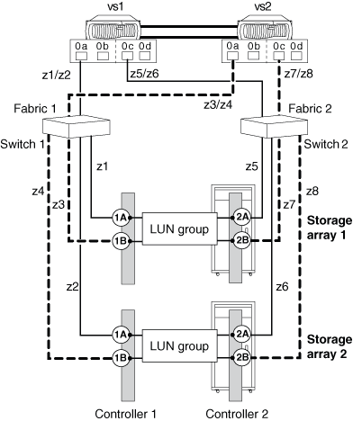

= 將 FC 啟動器連接埠連接至多個目標連接埠
:allow-uri-read: 
:icons: font
:imagesdir: ../media/

[role="lead"]
您可以將 ONTAP 系統上的 FC 啟動器連接埠連接至同一個系列中不同儲存陣列上的多個目標連接埠。ONTAP 中的 MetroCluster 組態支援此組態。

ONTAP 支援在 HA 配對和獨立系統中、與多個目標連接埠共用 FC 啟動器連接埠。此組態支援與互操作性對照表中所列的所有儲存陣列搭配使用、並支援在您的系統上執行的 ONTAP 版本。

[NOTE]
====
如需與多個目標連接埠和分區共用 FC 啟動器連接埠的詳細資訊、請參閱 _ FlexArray 虛擬化安裝需求和參考 _ 中的資訊

====

== 單一 ONTAP FC 啟動器連接埠、連接至不同儲存陣列上的目標連接埠

以下範例顯示 HA 配對、其中單一 ONTAP FC 啟動器連接埠會連線至不同儲存陣列上的多個目標連接埠：

*相關資訊*

https://mysupport.netapp.com/matrix["NetApp 互通性對照表工具"]

https://docs.netapp.com/us-en/ontap-flexarray/install/index.html["介紹虛擬化安裝需求與參考資料FlexArray"]

https://docs.netapp.com/us-en/ontap-metrocluster/install-fc/index.html["Fabric附加MetroCluster 的安裝與組態"]
