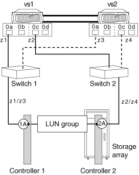

= 與兩個 FC 啟動器連接埠共用目標連接埠
:allow-uri-read: 
:icons: font
:imagesdir: ../media/

[role="lead"]
在各個節點之間最多可連接兩個 ONTAP FC 啟動器連接埠、連接至儲存陣列上的單一目標連接埠。ONTAP 中的 MetroCluster 組態支援此組態。

此組態支援與互操作性對照表中所列的所有儲存陣列搭配使用、並支援在您的系統上執行的 ONTAP 版本。

下圖顯示具有 HA 配對的共用目標連接埠組態。獨立系統和 HA 配對均支援與兩個 FC 啟動器連接埠共用目標連接埠。

[NOTE]
====
如需與多個目標連接埠和分區共用 FC 啟動器連接埠的詳細資訊、請參閱 _ FlexArray 虛擬化安裝要求與參考 _

====

== 連接至 FC 啟動器連接埠的共用目標連接埠

以下範例顯示 HA 配對、其中單一目標連接埠連接至兩個 FC 啟動器連接埠：

控制器 VS1 和 VS2 的啟動器連接埠 0A 連接至儲存陣列連接埠 1A 、而控制器的連接埠 0c 則連接至儲存陣列連接埠 2A 。

*相關資訊*

https://mysupport.netapp.com/matrix["NetApp 互通性對照表工具"]

https://docs.netapp.com/us-en/ontap-flexarray/install/index.html["介紹虛擬化安裝需求與參考資料FlexArray"]
