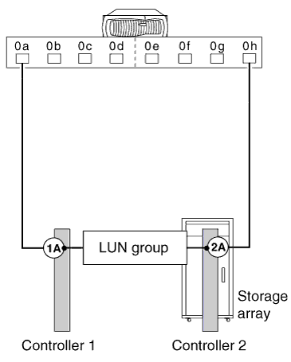
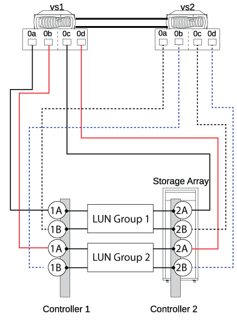
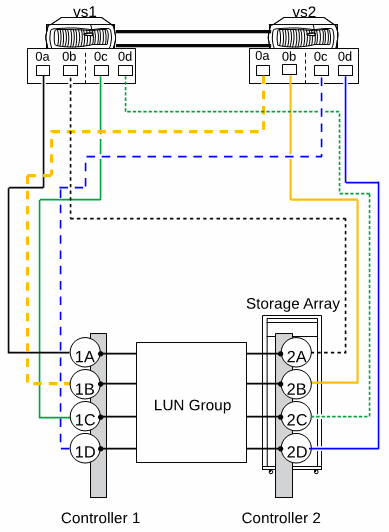

= 支援 E-Series 儲存陣列的直接附加組態
:allow-uri-read: 
:icons: font
:imagesdir: ../media/

[role="lead"]
您可以使用 E-Series 儲存陣列、以直接附加的組態連接 ONTAP 系統。您必須驗證 ONTAP 系統與儲存陣列之間連線的備援性、以避免單點故障的可能性。FlexArray Stretch MetroCluster 支援 E-Series 儲存陣列的直接附加組態。如需詳細資訊、請參閱 https://mysupport.netapp.com/matrix["NetApp 互通性對照表工具"] 和 https://docs.netapp.com/us-en/ontap-metrocluster/install-stretch/index.html["延伸MetroCluster 安裝與組態"]。

互通性對照表包含 ONTAP 系統直接附加組態所支援的特定 E-Series 陣列機型資訊。

ONTAP 支援下列 E-Series 儲存陣列的直接附加組態：

== 獨立式基本組態

在獨立的基本組態中、 ONTAP 系統的兩個 FC 啟動器連接埠會存取雙埠陣列 LUN 群組的連接埠。

下圖顯示直接附加的組態、其中 ONTAP FC 啟動器連接埠 0A 和 0 小時存取雙埠陣列 LUN 群組的目標連接埠：

== 四埠陣列 LUN 群組

HA 配對中每個 ONTAP 系統的兩個 FC 啟動器連接埠、可存取四埠陣列 LUN 群組中的不同儲存陣列連接埠、以提供連線的備援功能。

下圖顯示直接附加的組態、 ONTAP FC 啟動器連接埠可存取四埠陣列 LUN 群組的目標連接埠。

image::../media/da_4port_hapair.gif[DA 4 連接埠無線通訊]

您也可以將 HA 配對中每個 ONTAP 系統的四個 FC 啟動器連接埠連接至兩個不同的四埠陣列 LUN 群組、以便連接埠配對中的每個 FC 啟動器連接埠存取替代 LUN 群組。

下圖顯示直接附加的組態、 ONTAP FC 啟動器連接埠可存取兩個四埠陣列 LUN 群組的目標連接埠：

== 八埠陣列 LUN 群組

HA 配對中每個 ONTAP 系統的四個 FC 啟動器連接埠、可存取八埠陣列 LUN 群組中的不同儲存陣列連接埠、以提供連線的備援功能。

下圖顯示直接附加的組態、 ONTAP FC 啟動器連接埠可存取八埠陣列 LUN 群組的目標連接埠：

