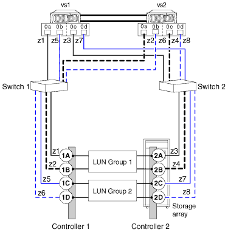

= 兩個 4 埠陣列 LUN 群組組組態
:allow-uri-read: 
:icons: font
:imagesdir: ../media/

[role="lead"]
在此組態中、每個 ONTAP FC 啟動器連接埠配對都會存取個別的陣列 LUN 群組。分區是單一 ONTAP FC 啟動器至單一陣列目標連接埠。

此組態支援與互操作性對照表中所列的所有儲存陣列搭配使用、並支援在您的系統上執行的 ONTAP 版本。

下圖顯示此組態的區塊圖：

*相關資訊*

https://mysupport.netapp.com/matrix["NetApp 互通性對照表工具"]
