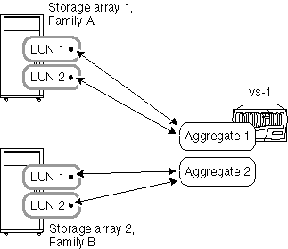
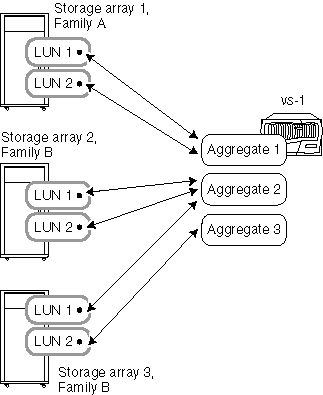

= 當儲存陣列來自不同廠商或系列時、彙總規則
:allow-uri-read: 
:icons: font
:imagesdir: ../media/

[role="lead"]
當儲存陣列來自不同廠商或來自同一廠商的不同儲存陣列系列時、您可以如何在集合體中配置陣列 LUN 。

如果您的儲存陣列來自同一廠商的不同廠商或不同系列、則適用下列規則：

* 您不能在同一個集合中混用來自不同廠商或同一廠商不同系列的儲存陣列 LUN 。
* 無論儲存陣列的系列類型為何、您都可以將包含根磁碟區的集合與任何儲存陣列建立關聯。

[NOTE]
====
建立 Aggregate 時、請務必明確指定要新增至 Aggregate 的陣列 LUN ID 。請勿使用參數來指定要取回的陣列 LUN 數量和大小、因為系統可能會自動從不同的系列或不同廠商的儲存陣列取回 LUN 。不同系列或廠商的陣列 LUN 位於同一個集合體中之後、修正集合體中混合陣列 LUN 問題的唯一方法是銷毀集合體並重新建立它。

====
下列範例顯示當儲存陣列來自 _ 不同廠商或來自同一廠商不同系列時、如何在集合體中配置陣列 LUN 的選項。

== 範例 1 ：兩個儲存陣列的 LUN 位於不同的集合體中

在此範例中、 ONTAP 的某些 LUN 來自儲存陣列 1 系列 A 、而 ONTAP 的其他 LUN 則來自儲存陣列 2 、 系列 B ：兩個儲存陣列的 LUN 無法新增至同一個集合體、因為這兩個儲存陣列來自同一廠商的不同系列。如果兩個儲存陣列來自不同廠商、情況也一樣。

== 範例 2 ：有些 LUN 可以混合在同一個集合中、有些則無法混合使用

在此範例中、 一個儲存陣列來自 A 系列、另兩個儲存陣列來自 B 系列。 A 系列儲存陣列的 LUN 無法新增至與 B 系列儲存陣列的 LUN 相同的集合、因為儲存陣列來自不同的系列。不過、儲存陣列 3 的 LUN 1 可指派給 Aggregate 2 、其中也包含儲存陣列 2 的 LUN 、因為這兩個儲存陣列屬於同一個系列。

