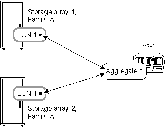
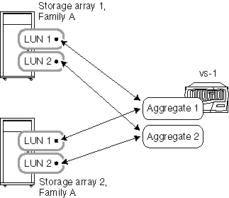

= 儲存陣列來自同一個系列時的集合規則
:allow-uri-read: 
:icons: font
:imagesdir: ../media/

[role="lead"]
當儲存陣列來自相同的儲存陣列廠商和型號系列時、您可以如何在集合體中配置陣列 LUN 、這是適用的特定規則。

如果您的儲存陣列來自同一家廠商、將陣列 LUN 新增至集合體的規則如下：

* 如果儲存陣列位於同一個系列中、您可以將儲存陣列中的陣列 LUN 混合在同一個集合中。
* 您可以將陣列 LUN 分隔成不同的集合體。

以下範例顯示當 ONTAP 系統後方的儲存陣列位於 _ 同一廠商系列 _ 時、在集合體中配置陣列 LUN 的一些選項。

[NOTE]
====
為了簡單起見、圖中只顯示兩個儲存陣列；您的部署可以包含更多儲存陣列。

====

== 範例 1 ：將所有儲存陣列的 LUN 新增至單一集合體

如下圖所示、您可以建立一個集合體、然後將同一個系列中所有儲存陣列的所有 LUN 新增至同一個集合體：

== 範例 2 ：透過多個集合體、從儲存陣列散佈和混合 LUN

如下圖所示、您可以建立多個集合體、然後在集合體上、從同一個系列中的不同儲存陣列散佈和混合陣列 LUN ：

[NOTE]
====
如果您擁有相同機型的儲存陣列、且其中一部具有光纖通道磁碟機、而另一部儲存陣列具有 SATA 磁碟機、則不支援此範例。在這種情況下、這些儲存陣列不會被視為屬於同一個系列。

====