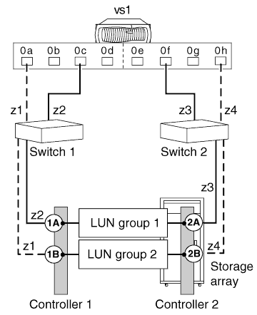

= 具有多個 LUN 群組的組態範例
:allow-uri-read: 
:icons: font
:imagesdir: ../media/

[role="lead"]
您可以使用多個 LUN 群組組組態、將工作負載分散到多個目標連接埠、藉此改善系統效能。

大多數儲存陣列都支援多個 LUN 群組組組態。請參閱 _ 互通性對照表 _ 、確認儲存陣列支援此組態。

下圖顯示 ONTAP 系統上的一個 FC 啟動器連接埠配對（ 0c 和 0f ）如何透過一個儲存陣列連接埠配對來存取一個 LUN 群組、 第二個 FC 啟動器連接埠配對（ 0A 和 0 小時）可透過不同的儲存陣列連接埠配對、存取同一個儲存陣列上的第二個 LUN 群組。

此組態稱為 _Stand-Alone 、具有兩個雙埠陣列 LUN 群組 _ 。多個 LUN 群組組組態可以有 HA 配對、而非獨立的系統。

此多個 LUN 群組組組態可讓您在儲存陣列上的 RAID 群組（同位元群組）之間分散 I/O 。您可以設定組態、讓不同的 FC 啟動器連接埠配對存取儲存陣列上的不同 LUN 群組。ONTAP 系統只會在兩個路徑上看到任何指定的陣列 LUN 、因為指定的 LDEV （邏輯裝置）只會對應到儲存陣列上的兩個備援連接埠。每個 LUN 群組都是透過不同的目標連接埠配對來存取。

每個 LDEV 都由一個 LUN ID 在外部識別。LDEV 必須對應至所有儲存陣列連接埠上的相同 LUN ID 、 ONTAP 系統才能透過該 ID 看到該 ID 。

[NOTE]
====
相同的 LUN ID 無法參照兩個不同的 LDEV 、即使使用相同 ID 的 LUN 位於目標連接埠上的不同主機群組。雖然同一個目標連接埠不支援 LUN ID 重複使用、但如果 LUN 對應至不同的儲存陣列連接埠、則儲存陣列支援 LUN ID 重複使用。

====
下表摘要說明此範例的分區。建議採用單一啟動器分區策略。

|===
| 區域 | ONTAP 系統上的 FC 啟動器連接埠 | 儲存陣列 

 a| 
交換器1.

 a| 
z1
 a| 
連接埠 0A
 a| 
控制器 1 連接埠 B

 a| 
z2
 a| 
連接埠 0c
 a| 
控制器 1 連接埠 A

 a| 
交換器2.

 a| 
z3
 a| 
連接埠 0f
 a| 
控制器 2 連接埠 A

 a| 
z4
 a| 
連接埠 0 小時
 a| 
控制器 2 連接埠 B

|===
*相關資訊*

https://mysupport.netapp.com/matrix["NetApp 互通性對照表工具"]
