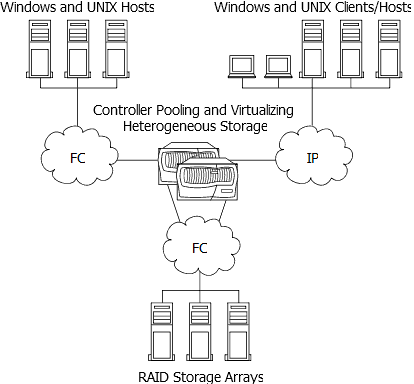

= FlexArray 虛擬化技術概述：使用陣列 LUN 進行儲存
:allow-uri-read: 
:icons: font
:imagesdir: ../media/

[role="lead"]
ONTAP 軟體提供統一化的儲存軟體平台、可簡化儲存陣列上原生磁碟櫃和 LUN 的管理。您可以在需要的時間和地點新增儲存設備、而不會中斷營運。此功能由 _ FlexArray 虛擬化軟體 _ 提供、先前稱為 V 系列。

下圖顯示已獲授權附加至儲存陣列的 ONTAP 系統將來自儲存陣列的 LUN 集合在一起、並將該儲存設備呈現給用戶端的組態。

ONTAP 系統會以 ONTAP 檔案系統磁碟區的形式、使用 ONTAP 管理功能在系統上管理儲存設備、或是建立 LUN 供用戶端使用的 SCSI 目標、將儲存設備呈現給用戶端。在這兩種情況下（檔案系統用戶端和 LUN 用戶端）、在可以使用陣列 LUN 的系統上、您可以將陣列 LUN 組合為一或多個陣列 LUN 集合體。在 ONTAP 環境中、您可以將這些陣列 LUN 集合體與儲存虛擬機器（ SVM ）建立關聯、並建立 ONTAP 磁碟區、以將其呈現給用戶端、做為檔案或由 ONTAP 提供的 LUN 。
