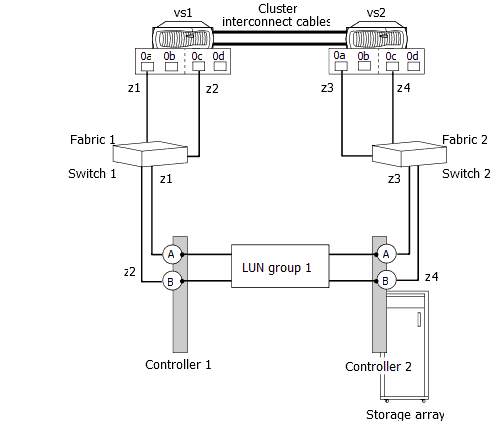

= 無效的路徑設定：未設定替代路徑
:allow-uri-read: 
:icons: font
:imagesdir: ../media/

[role="lead"]
請務必從 ONTAP 系統上的兩個 FC 啟動器設定通往所有陣列 LUN 的替代路徑、以避免單點故障（ SPOF ）。

下列組態無效、因為它不會提供從 ONTAP 系統上每個 FC 啟動器連接埠到儲存陣列上每個 LUN 的替代路徑。來自同一 ONTAP 系統的兩個 FC 啟動器連接埠、都會透過同一個交換器連接至儲存陣列。

假設下列分區已在這個無效範例中存在：

* 對於vs1：
+
** 0A 分區用於查看控制器 1 連接埠 A
** 0C 分區為查看控制器 1 連接埠 B

* 對於vs2：
+
** 0A 分區用於查看控制器 2 連接埠 A
** 0C 分區為「控制器 2 連接埠 B 」

在此範例組態中、每個交換器都會變成 SPOF 。

若要將此設定設為有效組態、必須進行下列變更：

* VS1 的 FC 啟動器連接埠 0c 必須連接至交換器 2 。
* VS2 的 FC 啟動器連接埠 0A 必須連接至交換器 1 。
* 必須設定適當的分區。
+
如果您在儲存陣列上使用多個連接埠、而該連接埠支援在選定的連接埠集上設定特定的 LUN 集、則指定的 FC 啟動器連接埠必須能夠看到架構上呈現的所有陣列 LUN 。

