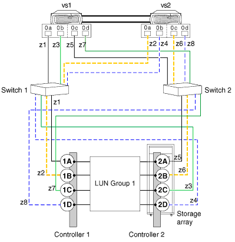
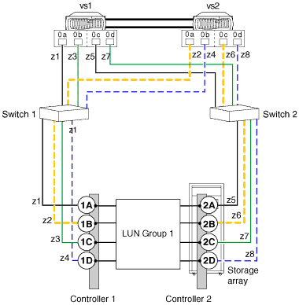

= 有效路徑：八埠陣列 LUN 群組組組態
:allow-uri-read: 
:icons: font
:imagesdir: ../media/

[role="lead"]
您可以使用八埠 LUN 群組組組態、在大型叢集部署中、將儲存陣列與 ONTAP 系統連線、這類部署需要比每個 LUN 群組的連接埠數量更少的路徑備援和負載平衡能力更高。

您可以使用交叉或交叉的後端連線來設定此組態。

== 跨越後端連線的變化

在後端連線交叉的組態中、來自相同儲存陣列控制器的 FC 連線會同時連線至兩個光纖交換器（備援）。

此連線配置可更有效地使用交換器連接埠和儲存陣列連接埠、而非跨越後端連線、進而降低交換器或儲存陣列控制器故障的影響。

對於只有兩個控制器的儲存陣列、最好使用交叉的八埠 LUN 群組組組態、而非交叉的八埠陣列 LUN 群組組組態。

當每個節點都有專用路徑（每個路徑有一個 FC 啟動器對單一目標連接埠分區）時、您只能跨越八埠陣列 LUN 群組。

在此交叉後端連線的圖例中、請注意 ONTAP 系統如何連接到交換器和儲存陣列。VS1 在連接至儲存陣列控制器 1 連接埠 1A 和控制器 2 連接埠 2C 時使用交換器 1 、並在連接至儲存陣列控制器 2 連接埠 2A 和控制器 1 連接埠 1C 時使用交換器 2 。

下表摘要列出八埠陣列 LUN 群組的分區、並提供交叉後端連線。建議採用單一啟動器分區策略。

|===
| 區域 | ONTAP 系統上的 FC 啟動器連接埠 | 儲存陣列 

 a| 
交換器1.

 a| 
z1
 a| 
VS1 、連接埠 0A
 a| 
控制器 1 、連接埠 1A

 a| 
z2
 a| 
VS2 、連接埠 0A
 a| 
控制器 1 、連接埠 1B

 a| 
z3
 a| 
VS1 、連接埠 0b
 a| 
控制器 2 、連接埠 2C

 a| 
z4
 a| 
VS2 、連接埠 0b
 a| 
控制器 2 、連接埠 2D

 a| 
交換器2.

 a| 
z5
 a| 
VS1 、連接埠 0c
 a| 
控制器 2 、連接埠 2A

 a| 
z6
 a| 
VS2 、連接埠 0c
 a| 
控制器 2 、連接埠 2B

 a| 
z7
 a| 
VS1 、連接埠 0d
 a| 
控制器 1 、連接埠 1C

 a| 
z8
 a| 
VS2 、連接埠 0d
 a| 
控制器 1 、連接埠 1d

|===

== 後端連線交叉的變化

在沒有通過後端連線的組態中、來自相同儲存陣列控制器的 FC 連線只會移至一個 Fabric 交換器。

下圖顯示組態中八埠陣列 LUN 群組不跨越後端連線的路徑：

下表摘要說明未跨越後端連線時、八埠陣列 LUN 群組的分區。建議採用單一啟動器分區策略。

|===
| 區域 | ONTAP 系統上的 FC 啟動器連接埠 | 儲存陣列 

 a| 
交換器1.

 a| 
z1
 a| 
VS1 、連接埠 0A
 a| 
控制器 1 、連接埠 1A

 a| 
z2
 a| 
VS2 、連接埠 0A
 a| 
控制器 1 、連接埠 1B

 a| 
z3
 a| 
VS1 、連接埠 0b
 a| 
控制器 1 、連接埠 1C

 a| 
z4
 a| 
VS2 、連接埠 0b
 a| 
控制器 1 、連接埠 1d

 a| 
交換器2.

 a| 
z5
 a| 
VS1 、連接埠 0c
 a| 
控制器 2 、連接埠 2A

 a| 
z6
 a| 
VS2 、連接埠 0c
 a| 
控制器 2 、連接埠 2B

 a| 
z7
 a| 
VS1 、連接埠 0d
 a| 
控制器 2 、連接埠 2C

 a| 
z8
 a| 
VS2 、連接埠 0d
 a| 
控制器 2 、連接埠 2D

|===

== 每個 FC 啟動器的陣列 LUN 數量上限考量事項

在使用八埠陣列 LUN 群組設定組態時、您不能超過 ONTAP 每個 FC 啟動器連接埠所支援的陣列 LUN 數量。
