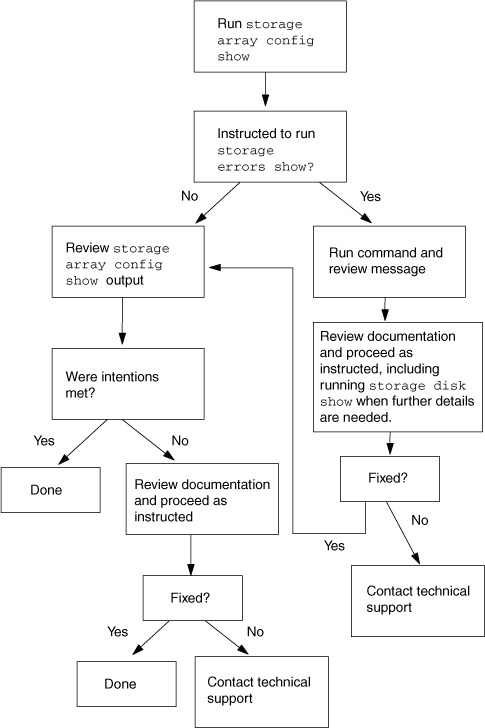

= 使用儲存陣列驗證安裝
:allow-uri-read: 
:icons: font
:imagesdir: ../media/

[role="lead"]
在正式作業環境中部署系統之前、請務必先偵測並解決任何後端組態錯誤。

驗證後端組態的兩個階段如下：

. 檢查是否有任何後端組態錯誤、使 ONTAP 無法與儲存陣列一起運作。
+
這些是由標記的錯誤 `storage errors show`。您必須修正這些錯誤。

. 檢查以確保組態符合您的預期。
+
有許多情況不是系統的錯誤、但可能不是您想要的。例如、輸出會 `storage array config show` 顯示兩個 LUN 群組、但您只打算使用一個 LUN 群組。本文提及的情況包括不符合您「意圖」的情況。

下圖顯示的工作流程會先從系統的角度驗證沒有組態錯誤、然後確認安裝是否符合您的預期。

