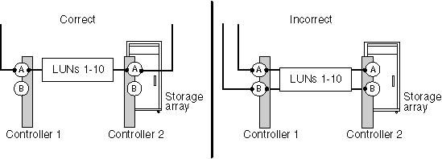

= 陣列 LUN 的所有路徑都位於同一個儲存陣列控制器上
:allow-uri-read: 
:icons: font
:imagesdir: ../media/

[role="lead"]
ONTAP 不支援設定通往相同儲存陣列控制器的所有路徑、因為這樣做會設定單點故障（ SPOF ）的組態。此 `storage errors show` 命令可識別任何陣列 LUN 、其路徑設定為前往相同的儲存陣列控制器。

ONTAP 不允許您將陣列 LUN 指派給 ONTAP 系統、直到您修正此錯誤為止。

== 儲存錯誤會顯示訊息

[listing]
----
NAME (UID): All paths to this array LUN are connected to the same fault domain. This is a single point of failure
----

== 說明

發生此錯誤的原因是、陣列 LUN 的路徑已設定為移至相同的儲存陣列控制器或 FRU 。

[NOTE]
====
使用四條路徑通往陣列 LUN 、一個具有多個導向器（例如 EMC Symmetrix 或 HDS USP ）的 FRU 儲存陣列、或是一個具有雙控制器（例如 EMC CX 或 HP EVA ）的儲存陣列、都是實現備援的好方法。不過、如果您設定路徑來穿過單一儲存陣列控制器或 FRU 、則即使具備這類功能、您也會使用 SPOF 來設定組態。在雙主動式儲存陣列上、整個 FRU 被視為一個故障網域。例如、 EMC Symmetrix 儲存陣列在同一個 FEBE 主機板上有多個通道導向器。FEBE 主機板被視為單一故障網域、因為如果所有路徑都穿過相同的 FEBE 主機板、則必須更換主機板時、所有路徑都會遺失。

====
下圖顯示正確且不正確的儲存陣列連接埠選擇、可設定通往陣列 LUN 的備援路徑、使您沒有單一故障網域。左側範例中的路徑設定正確、因為陣列 LUN 的路徑是備援的、每個連線都是儲存陣列上不同控制器上的連接埠。在右側的範例中、兩條通往陣列 LUN 的路徑都會移至相同的控制器、該控制器會設定 SPOF 。

此 `storage errors show` 命令會顯示位於同一個故障網域中的陣列 LUN 。如果您查看 TPGN 欄（目標連接埠群組編號）、也可以在輸出中看到此問題 `storage disk show` 。對於啟動器連接埠配對中的每個啟動器、應顯示不同的 TPGN 。如果兩個配對中的啟動器的 TPGN 相同、則兩個啟動器都位於相同的故障網域。

以下 `storage disk show` 範例顯示透過啟動器 0A 和 0c 存取 LUN 30 的 TPGN 1 。如果路徑為備援、則每個啟動器都會顯示不同的 TPGN 。

[listing]
----

mysystem1::> storage disk show mysystem1:vgbr300s70:9.126L30
                  Disk: HP-1.15
        Container Type: unassigned
            Owner/Home: -  / -
               DR Home: -
                 Array: HP_HSV450_1
                Vendor: HP
                 Model: HSV450
         Serial Number: 600508B4000B63140000800001660000
                   UID: 600508B4:000B6314:00008000:01660000:00000000:...
                   BPS: 512
         Physical Size: -
              Position: present
Checksum Compatibility: block
             Aggregate: -
                  Plex: -
Paths:
                     LUN Initiator Side   Target Side
Controller Initiator ID  Switch Port      Switch Port     Acc Use  Target Port      TPGN...
---------- --------- --- ---------------- --------------- --- ---  ---------------- -----
mysystem1    0c      30  vgci9148s75:1-12 vgci9148s75:1-9 AO  RDY  50014380025d1509   1
mysystem1    0a      30  vgbr300s70:12    vgbr300s70:9    AO  INU  50014380025d1508   1

Errors:
HP-1.15 (600508b4000b63140000800001660000): All paths to this array LUN are connected to the same fault domain. This is a single point of failure.
----
[NOTE]
====
本範例中的完整 UID 為 600508B4 ： 000B6314 ： 00008000 ： 01660000 ： 00000000 ： 00000000 ： 00000000 ： 00000000 ： 00000000 ： 00000000 ： 00000000 。範例中因為空間而被截斷。

====

== 疑難排解與問題解決

必須重新設定陣列 LUN 的路徑、以便移至備援儲存陣列控制器或 FRU 。

. 將纜線新增至其他控制器上的備援目標連接埠。
+
您應該在修正此問題的同時、將纜線新增至替代控制器、然後再使用 SPOF 從控制器拔下纜線。在這種情況下、備援是因為您暫時將路徑數量增加到三條路徑、而不是在解決問題時將路徑數量減少到一條。

. 從使用 SPOF 設定的控制器上拔下一條纜線。
+
現在您有兩條通往陣列 LUN 的備援路徑。

. 從 ONTAP 命令列再次輸入下列命令、並確認錯誤已修正： `storage errors show`

