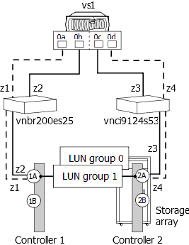

= 目標連接埠上的 LUN ID 重複
:allow-uri-read: 
:icons: font
:imagesdir: ../media/

[role="lead"]
同一個儲存陣列目標連接埠上的每個陣列 LUN 都必須具有唯一的 LUN ID 。輸出會 `storage errors show` 識別在同一個目標連接埠上顯示相同 LUN ID 的 LUN 。

== 儲存錯誤會顯示訊息

[listing]
----

NAME (UID), port WWPNx: LUN x occurs more than once.  LUNs cannot be reused on the same array target port.
----

== 說明

目標連接埠上重複 LUN ID 的常見原因是分區錯誤。系統管理員將 ONTAP 系統的 FC 啟動器放入不同的主機群組中、以便在儲存陣列上建立多個 LUN 群組、但隨後會發生分區錯誤、讓不同主機群組中的啟動器能夠存取相同的目標連接埠。

當發生這類分區錯誤時、 `storage array config show` 輸出會顯示兩個具有相同目標連接埠的 LUN 群組。

== 問題案例

系統管理員想要對應四個 LDEVs （ a 、 b 、 c 和 d ）以供 ONTAP 使用、兩個 LUN 群組各對應兩個 LDEVs 。在此案例中、假設儲存陣列將 LDEVs 呈現給啟動器連接埠、而不考慮啟動器存取儲存陣列的目標連接埠；也就是說、主機群組並非特定於目標連接埠。分區必須用來控制每個啟動器存取的目標連接埠、以建立 LUN 群組。

[NOTE]
====
對於某些儲存陣列（例如 HP EVA ）、所有目標連接埠的主機群組都相同。對於 Hitachi 等其他儲存陣列、主機群組是特定於目標連接埠的。

====
系統管理員會依照下列方式正確設定兩個主機群組、以便有兩個 LUN 群組：

|===
| 主機群組 | 主機群組中的 FC 啟動器 | LDEVs 和相關的 LUN ID 

 a| 
1
 a| 
0a0c
 a| 
LDEV A/LUN 1LDEV b/LUN 2

 a| 
2
 a| 
0B 0d
 a| 
LDEV c/LUN 1LDEV d/LUN 2

|===
分區應設定如下：

* 主機群組 1 、 0A 和 0c 中的啟動器應分區至目標連接埠配對 1A 和 2A 。
* 主機群組 2 、 0b 和 0d 中的啟動器應分區為目標連接埠配對 1B 和 2B 。

請注意、上表中的 LDEV A 和 LDEV c 都具有相同的 LUN ID （ L1 ）。同樣地、 LDEV b 和 LDEV d 都具有相同的 LUN ID （ L2 ）。如果分區設定正確、這種 LUN ID 複製並不是問題、因為支援在不同的目標連接埠上重複使用 LUN ID 。

此案例中的問題是在設定分區時、某些啟動器會置於錯誤的區域、如下表所示：

|===
| 區域 | ONTAP系統 |  | 儲存陣列 |  

 a| 
交換器 vnbr200es25.

 a| 
z1
 a| 
vs1
 a| 
連接埠 0A
 a| 
控制器1
 a| 
連接埠1A

 a| 
z2
 a| 
vs1
 a| 
連接埠 0b.
 a| 
控制器1
 a| 
連接埠 1A （而非 1B ）

 a| 
交換器 vnci9124s53

 a| 
z3
 a| 
vs1
 a| 
連接埠 0c
 a| 
控制器2
 a| 
連接埠2A

 a| 
z4
 a| 
vs1
 a| 
連接埠 0d
 a| 
控制器2
 a| 
連接埠 2A （而非 2B ）

|===
下圖顯示分區錯誤的結果：

如圖所示、會建立兩個 LUN 群組。不過、由於分區錯誤、 LUN 群組 0 和 LUN 群組 1 位於同一個目標連接埠配對（ 1A 和 2A ）、而不是在每個目標連接埠配對上有一個 LUN 群組。

本範例的下列 `storage array config show` 輸出顯示兩個 LUN 群組。問題在於兩個 LUN 群組具有相同的目標連接埠。

[listing]
----

vs1::> storage array config show

       LUN    LUN
Node  Group  Count  Array Name   Array Target Ports     Switch Port   Initiator
----- ----- ------- -----------  -------------------    ----------    ---------

 vs1    0       2   DGC_RAID5_1  20:1A:00:a0:b8:0f:ee:04  vnbr200es25:5  0a
                                 20:2A:00:a0:b8:0f:ee:04  vnci9124s53:6  0c
        1       2   DGC_RAID5_1  20:1A:00:a0:b8:0f:ee:04  vnbr200es25:5  0b
                                 20:2A:00:a0:b8:0f:ee:04  vnci9124s53:6  0d

Warning: Configuration were errors detected.  Use 'storage errors show' for detailed information.
----
本範例的下列 `storage errors show` 輸出會識別出有問題的 LUN ：

[listing]
----

vs1::> storage errors show

Disk: EMC-1.1
UID: UID-a
----------
EMC-1.1 (UID-a), port WWPN1: LUN 1 occurs more than once.  LUNs cannot be reused on the same array target port.

Disk: EMC-1.2
UID: UID-b
----------
EMC-1.2 (UID-b), port WWPN1: LUN 2 occurs more than once.  LUNs cannot be reused on the same array target port.

Disk: EMC-1.3
UID: UID-c
----------
EMC-1.3 (UID-c), port WWPN2: LUN 1 occurs more than once.  LUNs cannot be reused on the same array target port.

Disk: EMC-1.4
UID: UID-d
----------
EMC-1.4 (UID-d), port WWPN2: LUN 2 occurs more than once.  LUNs cannot be reused on the same array target port.
----
在此範例中、 `storage errors show` 您可以看到所有四個 LDEVs 的 UUID 都會顯示出來、但只有兩個唯一的 LUN ID ： LUN 1 和 LUN 2 。 而非四個。

== 疑難排解與問題解決

儲存陣列管理員必須修正分區、使不同主機群組中的啟動器無法存取相同的目標連接埠。

. 在 `storage array config` 輸出中、尋找正在與相同目標連接埠通話的啟動器。
. 輸入下列命令以檢視錯誤的詳細資料： `storage errors show`
. 確定 LUN ID 複製的 LDEV 。
. 對於控制器 1 上的每個目標連接埠（其中有多個啟動器對應至同一個 ONTAP 系統）、請變更分區、使兩個 FC 啟動器與同一個目標連接埠通話。
+
您正在執行此步驟、因為不同主機群組中的啟動器不應位於同一個區域。您必須一次在一個啟動器上執行此步驟、以便永遠有通往陣列 LUN 的路徑。

. 在控制器 2 上重複此程序。
. 輸入 `storage errors show` ONTAP 並確認錯誤已修正。」

