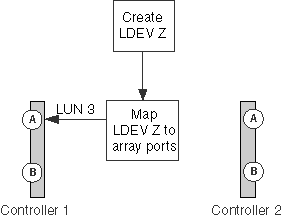

= 到陣列 LUN 的路徑少於兩條
:allow-uri-read: 
:icons: font
:imagesdir: ../media/

[role="lead"]
通往陣列 LUN 的路徑少於兩條的常見原因包括對應錯誤、分區錯誤或纜線掉出。 `storage errors show`輸出僅使用單一路徑來識別陣列 LUN 。

ONTAP 需要通往陣列 LUN 的備援路徑、以便在裝置故障時仍能維持對 LUN 的存取。每個陣列 LUN 必須有兩條路徑。

== 儲存錯誤會顯示訊息

[listing]
----

NAME (UID):  This Array LUN is only available on one path.  Proper configuration requires two paths.
----

== 說明

您看到陣列 LUN 的路徑少於兩條的原因包括：

* LDEV 只會對應到一個儲存陣列連接埠。
* 陣列 LUN 的第二條路徑未分區。
* 主機群組對應發生問題。
* 交換器連線有問題。
* 纜線掉出。
* SFP 在介面卡上失敗。

[NOTE]
====
如果某個路徑在執行中的系統上掉落、就會產生 EMS 訊息。

====

== 問題案例

在此對應錯誤範例中、假設儲存管理員建立了新的 LDEV Z 。管理員將 LDEV Z 對應為 LUN ID 3 至目標連接埠 1A 。不過、系統管理員並未將 LDEV 對應至目標連接埠 2A 、如下圖所示。結果只有一條通往陣列 LUN 的路徑。

發生此錯誤時、 `storage array config show` 輸出只會顯示通往 LUN 的一條路徑、如下例所示。

[listing]
----

mysystem1::> storage array config show
           LUN     LUN
Node       Group   Count  Array Name    Array Target Ports      Switch Port   Initiator
-------   -------  -----  ----------   -------------------      -----------    ---------
mysystem1a    0      1    DGC_RAID5_1  20:1A:00:a0:b8:0f:ee:04  vnbr20es25:5   0a

Warning: Configuration errors were detected.  Use 'storage errors show' for detailed information.
----
此命令會 `storage errors show` 提供您所需的詳細資料、以判斷哪一個 LUN 的路徑少於兩個。

[listing]
----

mysystem1a::> storage errors show
Disk: EMC-1.2
UID: 600508B4:000B6314:00008000:00200000:00000000:00000000:00000000:...
--------------------
EMC-1.2 (600508b4000b63140000800000200000): This array LUN is only available on one path. Proper configuration requires two paths.
----
[NOTE]
====
此範例的 UID 為 600508B4 ： 000B6314 ： 00008000 ： 00200000 ： 00000000 ： 00000000 ： 00000000 ： 00000000 ： 00000000 ： 00000000 ： 00000000 。由於空間的緣故、它會被截斷。

====

== 疑難排解與問題解決

當疑難排解陣列 LUN 的兩條路徑少於兩條時、無論 `storage array config show` 是輸出或儲存錯誤、都會顯示輸出都很有幫助。

. 檢閱 `storage errors show` 輸出、以取得僅在一條路徑上可用的陣列 LUN 序號。
. 檢閱 `storage array config show` 輸出、嘗試找出問題的原因。
+
|===
| 如果 `storage array config show` 輸出顯示 ... | 原因很可能是 ... 

 a| 
其他陣列 LUN
 a| 
對應錯誤

 a| 
無其他陣列 LUN
 a| 
纜線錯誤、分區錯誤或硬體問題

|===
. 如果原因是對應錯誤、請讓儲存陣列管理員將識別的陣列 LUN 對應至兩個備援儲存陣列連接埠。
. 如果原因似乎不是對應問題、請檢查分區、主機群組對應、纜線和連線能力。
. 解決問題之後、請再次執行 `storage array config show` 以確認錯誤已修正。

