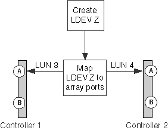

= 同一個 LDEV 的 LUN ID 不相符
:allow-uri-read: 
:icons: font
:imagesdir: ../media/

[role="lead"]
邏輯裝置（ LDEV ）必須對應至所有儲存陣列連接埠上的相同 LUN ID 、 ONTAP 系統必須能透過該 ID 看到該 ID 。輸出會 `storage errors show` 識別 LUN ID 不相符的 LDEVs 。

如果 LUN ID 不相符、 ONTAP 不允許您將陣列 LUN 指派給 ONTAP 系統。

== 儲存錯誤會顯示訊息

[listing]
----

HIT-1.4 (4849544143484920443630303035323430303132): This Array LUN is using multiple LUN IDs.  Only one LUN ID per serial number is supported.
----

== 說明

儲存陣列組態期間發生下列錯誤之一：

* LDEV 會從多個目標連接埠呈現給 ONTAP 系統的同一個 FC 啟動器連接埠、而且 LUN ID 不一致。
* 交換兩個 LDEVs 的 LUN ID 。
+
在這種情況下、會針對每個陣列 LUN 回報錯誤。

* 將 LDEV 對應至將 LDEV 呈現給 ONTAP 系統的儲存陣列連接埠時、會使用相同 LDEV 的不同 LUN ID 。

[NOTE]
====
此錯誤很可能發生在儲存陣列上、例如 Hitachi 儲存陣列上的每個連接埠都是分別設定的。在某些儲存陣列（例如 IBM 儲存陣列）上、連接埠並未個別設定。

====
* 磁碟區集定址設定在 LUN 對應的連接埠上不一致。
+
在 EMC Symmetrix 儲存陣列上、問題在於「 Volume Set Addressing 」（ Volume Set 定址）設定會因通道導向器連接埠而異。

== 問題案例

本案例討論適用於大多數儲存陣列的 LUN ID 不一致的情況。請參閱「 Volume Set 定址不一致」一節、以瞭解在設定錯誤的 Volume Set 定址內容中、此相同錯誤訊息的討論內容。

xref:reference_volume_set_addressing_is_inconsistent.adoc[Volume Set 定址不一致]

假設儲存陣列管理員建立新的 LDEV Z 。 LDEV Z 的 LUN ID 應該是 LUN 3 。不過、管理員會在儲存陣列控制器連接埠 1A 上顯示 LDEV Z 為 LUN 3 、在儲存陣列控制器連接埠 2A 上顯示為 LUN 4 、如下圖所示：

若要修正此問題、必須在所有對應 LDEV 的連接埠上、將相同的 LUN ID 指派給 LDEV 。在此範例中、 LDEV 應在兩個連接埠上顯示為 LUN ID 3 。

== 疑難排解與問題解決

若要修正此問題、儲存陣列管理員必須使用正確的 LUN ID 重新對應 LUN 。您可以使用 ONTAP 命令取得所需的詳細資料、以便向儲存管理員提供問題的相關資訊。

. 檢閱 `storage errors show` 輸出以識別 LUN ID 不相符的陣列 LUN 。
+
當同一個 LDEV 的 LUN ID 不相符時、輸出會識別出問題所在的 LDEV 序號。例如：

+
[listing]
----

mysystem1a::> storage errors show
Disk: HIT-1.4
UID: 48495441:43484920:44363030:30353234:30303132:00000000:...
----------

HITACHI_DF600F_1
----------
HIT-1.4 (4849544143484920443630303035323430303132): This Array LUN is using multiple LUN IDs.  Only one LUN ID per serial number is supported.
----
+
[NOTE]
====
本範例中的 UID 為 484954441 ： 43484920 ： 44363030 ： 30353234 ： 30303132 ： 00000000 ： 00000000 ： 00000000 ： 00000000 ： 00000000 ： 00000000 。範例中因為空間而被截斷。

====
. 輸入下列命令、即可取得相同 LDEV 使用的 LUN ID 詳細資料： `storage disk show arrayLUNname`
+
 `storage disk show`此範例的輸出顯示下列內容：

+
[listing]
----

mysystem1a::> storage disk show -disk HIT-1.4
                  Disk: HIT-1.4
        Container Type: unassigned
            Owner/Home: -  / -
               DR Home: -
                 Array: HITACHI_DF600F_1
                Vendor: HITACHI
                 Model: DF600F
         Serial Number: D600020C000C
                   UID: 48495441:43484920:44363030:30353234:30303132:00000000:...
                   BPS: 512
         Physical Size: -
              Position: present
Checksum Compatibility: block
             Aggregate: -
                  Plex: -
Paths:
                     LUN  Initiator Side  Target Side
Controller Initiator ID   Switch Port     Switch Port      Acc Use  Target Port     TPGN...
---------- --------- -------------------- ----------------- --- ---  --------------- ----
mysystem1a   0c       4  vgci9148s76:1-2  vgci9148s76:1-9  AO  INU  50060e80004291c1  1
mysystem1a   0a       3  vgbr300s89:1     vgbr300s89:9     S   RDY  50060e80004291c0  2
mysystem1b   0c       4  vgci9148s76:1-4  vgci9148s76:1-9  AO  INU  50060e80004291c1  1
mysystem1b   0a       3  vgbr300s89:3     vgbr300s89:10    S   RDY  50060e80004291c2  2

Errors:
HIT-1.4 (4849544143484920443630303035323430303132): This Array LUN is using multiple LUN IDs.  Only one LUN ID per serial number is supported.
----

[NOTE]
====
本範例中的 UID 為 484954441 ： 43484920 ： 44363030 ： 30353234 ： 30303132 ： 00000000 ： 00000000 ： 00000000 ： 00000000 ： 00000000 ： 00000000 。範例中因為空間而被截斷。

====
透過查看儲存磁碟 show 輸出的 Paths 區段中的 LUN ID 、您可以看到 LUN ID 3 和 4 都用於此 LDEV 。

. 確定哪個 LUN ID 不適用於 LDEV 。
+
LUN ID 4 是本範例中不正確的 LUN ID 。

. 在 ONTAP 中、使用 `storage path quiesce` 命令來使陣列 LUN 的路徑不正確。
+
以下範例顯示要新增至啟動器 0c 上要在其上處於無磁碟狀態之路徑的命令選項 `storage path quiesce` --LUN ID 4 。

+
[listing]
----

storage path quiesce -node mysystem1a -initiator 0c -target-wwpn 50060e80004291c1 -lun-number 4
----
+
命令會 `storage path quiesce` 暫時暫停特定路徑上特定陣列 LUN 的 I/O 。某些儲存陣列需要在移除或移動陣列 LUN 時、停止 I/O 一段時間。

+
路徑停止後、 ONTAP 將無法再看到該 LUN 。

. 等待一分鐘、讓儲存陣列的活動計時器過期。
+
雖然並非所有儲存陣列都需要一段時間才能停止 I/O 、但最好還是這樣做。

. 在儲存陣列上、使用正確的 LUN ID （本案例中的 LUN ID 3 ）將 LUN 重新對應至目標連接埠。
+
下次執行 ONTAP 探索程序時、它會探索新的陣列 LUN 。探索會每分鐘執行一次。

. ONTAP 探索完成後、請再次在 ONTAP 中執行 `storage array config show` 、以確認不再發生錯誤。

