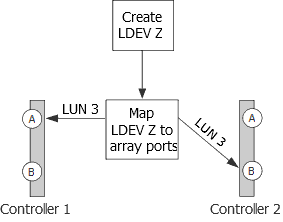

= 陣列 LUN 群組數量超出預期的原因
:allow-uri-read: 
:icons: font
:imagesdir: ../media/

[role="lead"]
驗證組態時、您應該檢查 `storage array config show` 輸出、以確保 LUN 群組數量符合您的預期。額外陣列 LUN 群組最常見的原因是 LDEV 跨越目標連接埠配對。

== 說明

常見原因如下：

* LDEV 未對應至備援目標連接埠配對。
+
額外 LUN 群組最常見的原因是 LDEV 是跨路徑配對。如果儲存陣列上的備援目標連接埠配對未顯示符合 LDEV 的 LUN ID 、則 LDEV 即為 _spanning path Pair 。

[NOTE]
====
在許多儲存陣列上、如果您遵循傳統的方法來建立和對應 LDEVs 、則無法將 LDEV 呈現給非備援的目標連接埠。

====
* ONTAP 在將陣列 LUN 從一個 LUN 群組移轉至另一個 LUN 群組期間、嘗試平衡目標連接埠的負載。
+
在這種情況下、 LDEV 跨距路徑配對是一種過渡狀態。

* 設定的連線太多。

ONTAP 可以與單一陣列 LUN 群組或多個陣列 LUN 群組一起執行。因此、 ONTAP 不會將任何數量的 LUN 群組視為組態錯誤。不過、並非所有 ONTAP 版本中的所有儲存陣列都支援多個 LUN 群組。在組態規劃期間、您應該檢查互通性對照表中的資訊、以確認 ONTAP 組態中所使用的儲存陣列是否支援多個陣列 LUN 群組。

== 問題案例

假設有兩個現有 LUN 群組： LUN 群組 0 和 LUN 群組 1 。LUN 群組 0 有兩個陣列 LUN 、而 LUN 群組 1 有三個陣列 LUN 。管理員建立了一個新的 LDEV Z 、打算將 LUN 3 新增至 LUN 群組 0 。管理員將兩個儲存陣列連接埠上的 LDEV Z 對應為 LUN 3 。但是、 LUN 3 對應的連接埠、儲存陣列連接埠 1A 和 2B 、並不是備援目標連接埠配對、如下圖所示。

此錯誤的結果是建立了第三個非預期的 LUN 群組（群組 2 ）、如下範例所示：

[listing]
----

mysystem1::> storage array config show

          LUN   LUN
Node      Group Count  Array Name  	Array Target Ports     	Switch Port  	Initiator
-------   ----- ------ ----------- 	-------------------    	-----------  	---------

mysystem1  0     3     DGC_RAID5_1  20:1A:00:a0:b8:0f:ee:04  vnbr20es25:5    0a
                                   	20:2A:00:a0:b8:0f:ee:04  vnci9124s53:6   0c
           1     3     DGC_RAID5_1  20:1B:00:a0:b8:0f:ee:04  vnbr20es25:7    0b
                                   	20:2B:00:a0:b8:0f:ee:04  vnci9124s53:8   0d
           2     1     DGC_RAID5_1  20:1A:00:a0:b8:0f:ee:04  vnbr20es25:5    0a
                                   	20:2B:00:a0:b8:0f:ee:04  vnci9124s53:8   0d
----
您可以從群組 0 和群組 1 的「陣列目標連接埠」欄中的資訊、推斷陣列目標連接埠的路徑是備援的。群組 0 會前往目標連接埠 1A 和 2A 、這是目標連接埠配對。群組 1 會移至 1B 和 2B 、這是不同的目標連接埠配對。

不過、「群組 2 的陣列目標連接埠」欄中的資訊顯示路徑並不是備援的。一條路徑通往目標連接埠 1A 、另一條路徑通往目標連接埠 2B 。這不是備援目標連接埠配對；陣列 LUN 跨越 LUN 群組。陣列 LUN 應已對應至 1A 、 2A 或 1B 和 2B 。

由於 ONTAP 系統可以使用 LDEV 跨距路徑配對來執行、因此在執行命令之後、不會出現指示您執行的訊息 `storage errors show` `storage array config show` 。不過、這不是最佳實務設定。

== 解決問題

. 等待一分鐘、然後再次執行 `storage array config show` 、查看輸出中是否仍顯示額外的 LUN 群組 `storage array config show` 。
+
** 如果輸出中不再有額外的 LUN 群組、您可以斷定問題是轉型問題。
** 如果輸出中仍出現額外的 LUN 群組、則儲存陣列管理員必須重新對應 LDEV 、如後續步驟所述。
+
您需要在修復此問題的同時維持備援。此程序會指示您將 LDEV 對應至正確的目標連接埠（ _ 之前 _ 移除對應至不正確的目標連接埠）。在這種情況下、備援是因為您暫時將路徑數量增加到三條、而不是在解決問題時將路徑數量減少到一條。

. 決定應重新對應哪些不一致的目標連接埠。
. 在儲存陣列上、將 LDEV 對應至新的（正確的）目標連接埠。
. 在 ONTAP 中、執行 `storage array config show` 以確認顯示三個路徑。
. 移除不正確的對應。
. 等待一分鐘、 ONTAP 才會發現 LUN 。
. 在 ONTAP 中、再次執行 `storage array config show` 以確保額外的 LUN 群組已移走。

*相關資訊*

https://mysupport.netapp.com/matrix["NetApp 互通性對照表工具"]
