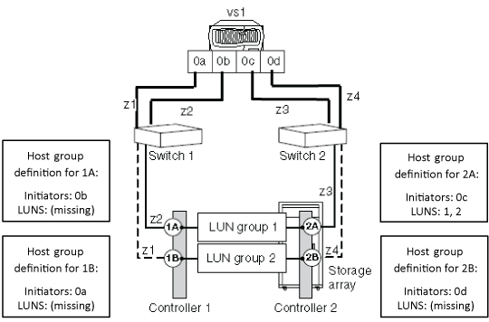

= 陣列 LUN 群組中沒有 LUN 的原因
:allow-uri-read: 
:icons: font
:imagesdir: ../media/

[role="lead"]
驗證後端組態時、您應該檢查 `storage array config show` 輸出、以判斷 LUN 是否顯示在 LUN 群組中。當 `storage array config show` 輸出顯示陣列 LUN 群組中沒有 LUN 時、 ONTAP 可以看到架構上的目標連接埠、但目標連接埠並未將陣列 LUN 呈現給 ONTAP 。

目標連接埠可能不會向 ONTAP 顯示陣列 LUN （ _ 開放目標連接埠 _ ）的原因有多種。開放目標連接埠的原因可能會因不同的儲存陣列而異。此外、處理開放式目標連接埠問題的方法也會因儲存陣列而異。對於所有儲存陣列、開放目標連接埠的故障排除應包括檢查儲存陣列組態、包括主機群組組組態。

例如、原因可能是 _ 空主機群組 _ 、它會將自己呈現給 ONTAP 、做為開放式目標連接埠。使用空主機群組時、主機群組會定義 FC 啟動器和目標連接埠、但不會列出任何陣列 LUN （即主機群組為空）。

[NOTE]
====
ONTAP 系統的運作不受空主機群組影響。

====
下圖顯示開放連接埠目標連接埠的情況、以及空的主機群組情況。（為簡化起見、圖中使用獨立的 ONTAP 系統。）

開放式目標連接埠是由儲存控制器 1A 的主機群組定義中缺少 LUN ID 所造成。在儲存控制器 1A 的主機群組定義中、 FC 啟動器 0b 會分區到目標連接埠、並有一個主機群組定義用於 FC 啟動器連接埠 0b 、但主機群組中沒有 LUN ID 。如圖所示、儲存控制器 2A 的主機群組定義包括啟動器和 LUN 。

空主機群組的原因在於儲存控制器 1B 和 2B 的主機群組定義中未列出陣列 LUN 。FC 啟動器 0A 和 0d 會分區到目標連接埠、但不會顯示 LUN 。

以下範例顯示 `storage array config show` ONTAP 系統已分區至儲存陣列、但儲存控制器 1A 的主機群組定義中沒有 LUN 的輸出、導致目標連接埠開放。控制器 1B 和 2B 在各自的主機群組定義中沒有 LUN 、因此會產生一個空的主機群組。

在圖示情況的輸出中、 FC 啟動器 0A 、 0b 和 0d 在 LUN 計數欄位中沒有 LUN 。對於 FC 啟動器 0c 、 LUN 群組 1 中會顯示兩個 LUN 。

[listing]
----
cluster-1::> storage array config show
          LUN   LUN
Node      Group Count  Array Name       Array Target Port   Initiator
--------- ----- -----  ------------     ------------------- ---------
vs1
           0     2     EMC_SYMMETRIX_1  50060480000001b0       0c

           1     0     EMC_SYMMETRIX_1  50060480000001a0       0b

           2     0     EMC_SYMMETRIX_1  50060480000001b1       0a

                 0     EMC_SYMMETRIX_1  50060480000001a1       0d

4 entries were displayed.
----
[NOTE]
====
從輸出中、您可以判斷問題並非因為主機群組中缺少 FC 啟動器所致。如果主機群組中缺少 FC 啟動器、 ONTAP 將無法看到沒有 LUN 的 LUN 群組。

====