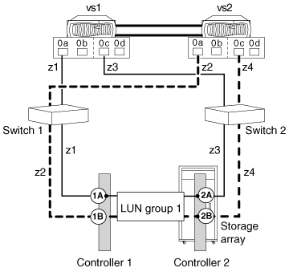

= 將 ONTAP 系統連接至儲存陣列
:allow-uri-read: 
:icons: font
:imagesdir: ../media/

[role="lead"]
將 ONTAP 系統連接至儲存陣列需要將 ONTAP 系統、交換器和儲存陣列連接在一起、並連接其他裝置、例如磁帶備份裝置。

*您需要的是什麼*

* 您必須已識別 ONTAP 系統的內建連接埠和擴充介面卡連接埠、才能連線至儲存陣列。
* 您必須在儲存陣列上找到要用來連線至 ONTAP 系統的連接埠。

本程序說明如何透過兩個路徑將 ONTAP 系統連接至儲存陣列、每個啟動器專用於一個目標連接埠。

.步驟
. 將 ONTAP 系統連接至交換器、如下表所示：
+
|===
| 適用於... | 請遵循下列步驟... 

 a| 
獨立式系統
 a| 
.. 將一條纜線從 ONTAP 系統上的一個 FC 啟動器連接埠連接至交換器 1 上的連接埠。
.. 將另一條纜線從備援 FC 啟動器連接埠連接至交換器 2 的連接埠。

 a| 
HA配對
 a| 
.. 在 HA 配對的第一個節點上、將一條纜線從一個 FC 啟動器連接埠連接到交換器 1 上的連接埠。
.. 將另一條纜線從同一個節點上的備援 FC 啟動器連接埠連接到交換器 2 上的連接埠。
.. 在 HA 配對的第二個節點上、將一條纜線從一個 FC 啟動器連接埠連接到交換器 1 上的連接埠。
.. 將另一條纜線從同一個節點上的備援 FC 啟動器連接埠連接到交換器 2 上的連接埠。

|===
. 請依照下表中的指示、將交換器連接至儲存陣列、而對於 HA 配對、請參閱下表：
+
|===
| 適用於獨立系統 ... | 對於 HA 配對 ... 

 a| 
.. 將交換器 1 連接至儲存陣列控制器 1 、連接埠 1A 。
.. 將交換器 2 連接至儲存陣列控制器 2 、連接埠 2A 。

 a| 
.. 將交換器 1 連接至儲存陣列控制器 1 、連接埠 1A 。
.. 將交換器 2 連接至儲存陣列控制器 2 、連接埠 2A 。
.. 將交換器 1 連接至儲存陣列控制器 1 、連接埠 1B 。
.. 將交換器 2 連接至儲存陣列控制器 2 連接埠 2B 。

|===
+
下圖顯示 HA 配對的連線。

+

. * 選用： * 透過獨立的 FC 啟動器連接埠或 SCSI 磁帶介面卡、將 ONTAP 系統連接至磁帶備份裝置。
. 確認儲存陣列已正確設定並連線、且已開啟電源。
+
您必須先開啟已設定且已連線的儲存陣列電源、才能開啟 ONTAP 系統電源。請參閱儲存陣列文件、瞭解如何開啟儲存陣列的電源。

. 如果您的部署包含交換器、請確定已設定所有交換器 ID 、然後每 10 分鐘開啟一次。
. * 選用： * 如果適用、請開啟任何磁帶備份裝置。
. 開啟 ONTAP 系統電源、然後執行初始網路設定和組態。
. 如果儲存陣列在您將 ONTAP 系統連線至儲存陣列之後、並未自動探索 ONTAP 系統 WWN 、則必須手動取得 WWN 。

您必須繼續適當的 ONTAP 管理功能設定、才能與儲存陣列搭配使用。
