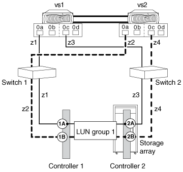

= 設定交換器
:allow-uri-read: 
:icons: font
:imagesdir: ../media/

[role="lead"]
交換器組態通常由儲存設備或 SAN 管理員來完成。交換器必須分區、才能讓 ONTAP 系統和儲存陣列彼此看到。您必須使用單一啟動器分區作為分區策略。

.步驟
. 登入儲存陣列、並取得儲存陣列 FC 介面卡的 WWPN 。
. 使用 Fibre Channel 交換器命令對每個交換器進行分區、讓儲存陣列和 ONTAP 系統能夠看到彼此的 WWPN 。
+
請考慮以下 HA 配對中的 ONTAP 系統範例：

+

+
在範例組態中、區域如下所示：

+
|===
| 區域 | ONTAP 系統和連接埠 | 儲存陣列控制器和連接埠 

 a| 
交換器1.

 a| 
z1
 a| 
VS1 、 0A
 a| 
控制器 1 、 1A

 a| 
z2
 a| 
VS2 、 0A
 a| 
控制器 1 、 1B

 a| 
交換器2.

 a| 
z3
 a| 
vs1 、 0c
 a| 
控制器 2 、 2A

 a| 
z4
 a| 
vs2 、 0c
 a| 
控制器 2 、 2B

|===

